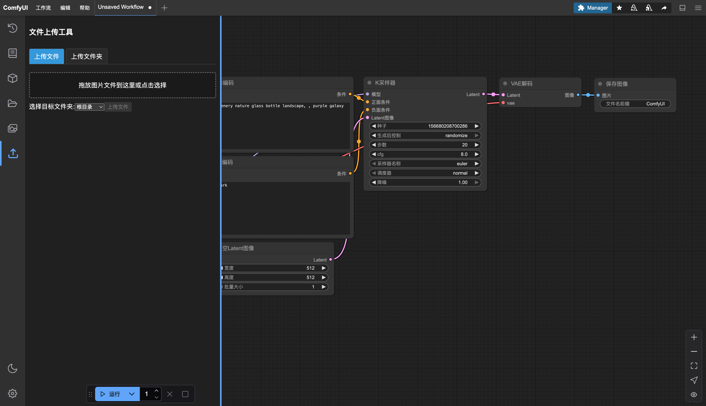

# ComfyUI 图片上传工具

这是一个ComfyUI扩展，允许用户通过简单的界面将文件夹或批量图片上传到ComfyUI的input目录中。

## 功能

- 文件夹上传：上传整个文件夹到input目录或其子目录
- 批量图片上传：多选图片上传，支持预览，兼容多种图片格式


## 安装

```bash
cd custom_nodes
git clone https://github.com/fichas/comfy-image-upload.git
```

重启ComfyUI服务器即可。

## 界面示例




